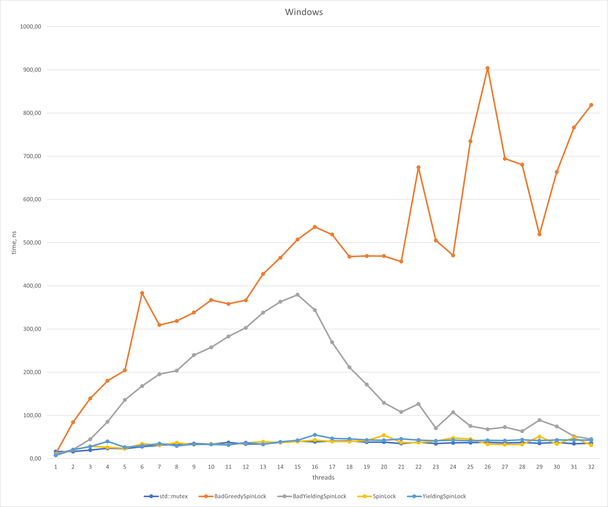
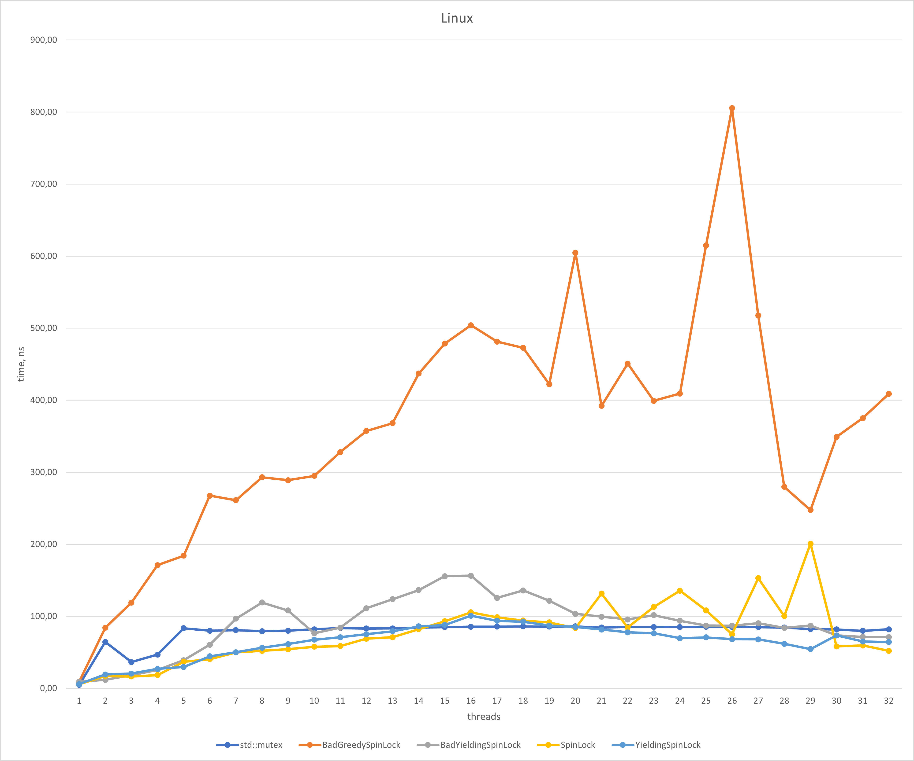

# spinlock-benchmark
Benchmarks of some spinlock implementations

# Results
Measurements are done on i7-10700 CPU (8C/16T), with number of threads up to 2x of hardware concurrency.

# References
1. https://rigtorp.se/spinlock/
2. https://probablydance.com/2019/12/30/measuring-mutexes-spinlocks-and-how-bad-the-linux-scheduler-really-is/
3. https://www.realworldtech.com/forum/?threadid=189711&curpostid=189723
